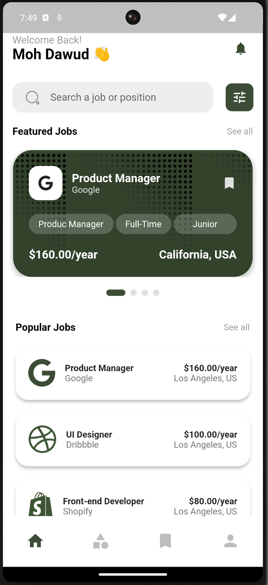
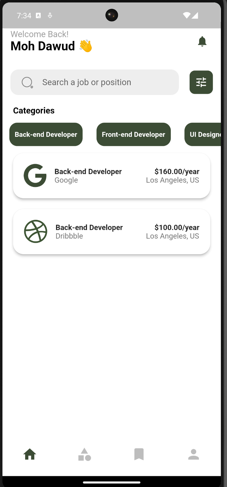
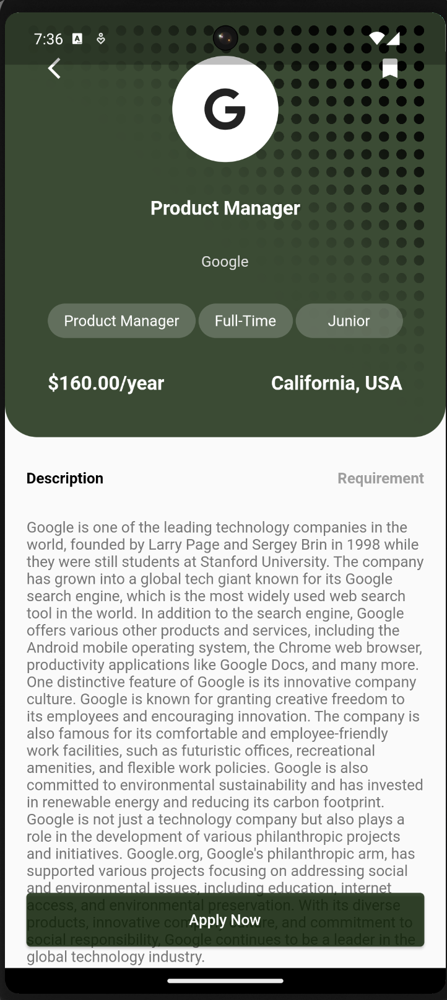

# Job Finder App

Job Finder App adalah aplikasi yang tujuan akhirnya dibuat untuk user dalam mencari pekerjaan di perusahaan yang telah di kami sediakan. Namun, pada pengembangan saat ini, masih dalam tahap design berupa 3 Halaman. Berikut design halaman pada Job Finder App:

- Halaman Home

- Halaman Category

- Halaman Detail Job

# Asset
Asset yang digunakan pada pengembangan Job Finder App ini yaitu hanya pattern2.png. Asset tersebut digunakan untuk background saja.
Berikut gambar dari pattern2.png:

# Paket yang digunakan
- https://pub.dev/packages/cupertino_icons
- https://pub.dev/packages/font_awesome_flutter
- https://pub.dev/packages/iconsax
- https://pub.dev/packages/smooth_page_indicator

A new Flutter project.

## Getting Started

This project is a starting point for a Flutter application.

A few resources to get you started if this is your first Flutter project:

- [Lab: Write your first Flutter app](https://docs.flutter.dev/get-started/codelab)
- [Cookbook: Useful Flutter samples](https://docs.flutter.dev/cookbook)

For help getting started with Flutter development, view the
[online documentation](https://docs.flutter.dev/), which offers tutorials,
samples, guidance on mobile development, and a full API reference.
